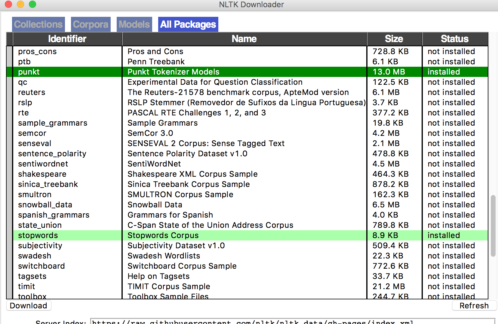

# ZJU Information Retrieval 2016 Final Project

## Setup Steps:

### 1. install nltk & ntlk data

nltk: 

``sudo pip install -U nltk``

nltk data:

``import nltk``

``nltk.download()``

and then pick **punkt** and **stopwords** to install

result: 

references:

http://www.nltk.org/install.html

http://www.nltk.org/data.html

### 2. Test

run index_example.py

```python index_example.py```


